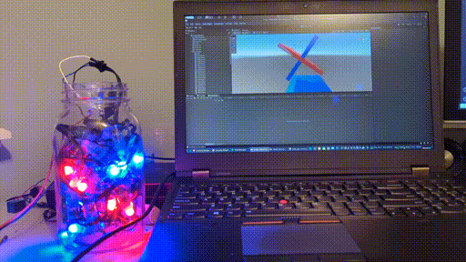

# SVLED
## Stochastic Volumetric LEDs (3D Mapped LEDs [pretty looking lights])
*Note videos of it working/Unity project cleanup is coming very soon. The code currently does work.*

This project allows you to scan a container full of individually addressible RGB leds, and create a representation of those LEDs in 3d space in Unity, where you can apply whatever effects in 3d that you desire.  
It also has the ability to save animations either to a file, or directly to the LED controller (ESP32).  
You can see a demo video setting up the LEDs here: `TODO: make video :3`  

You can see a short demo video here: `TODO: make video`  

Please note that a much cooler demo with gyroscopes and multiple containers is coming soon :3  

*Alot of this code was written in around a week, and school was taking most of my time, so if there are any issues with documentation or code, please let me know and I will be happy to help*

## Usage

If you want to use this project, you will need a couple of things:
 - LEDs - anything that is supported by FastLED will work fine.
 - A ESP32 or ESP8266 depending on the number of LEDs and features that you want  
 
Once you have the hardware, go to the [Wiki.](https://github.com/timothyhay256/Stochastic-volumetric-LED-display/wiki/Setting-up-LEDs)

## SVLED-RS
If you want to help contribute, please note that the current plan is to rewrite all the Python into Rust so this project is actually usable. (Currently you are bound to run into runtime errors.)

## Rewrite progress

| Script  | Rewrite status |
| ------------- | ------------- |
| led_manager.rs  | Rewritten, not fully tested |
| speedtest.rs  | Complete |
| read_vled.rs | Rewritten, not fully tested |
| scan.rs | In progress |
| unity_get_event.rs | In progress (unity.rs) |
| unity_manager.rs | Not started |
| unity_send_pos.rs | In progress (unity.rs) |
